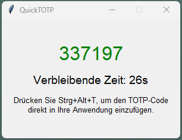

# QuickTOTP

## Beschreibung des Projekts

**QuickTOTP** ist eine kleine GUI-Anwendung, die entwickelt wurde, um TOTP-Codes anzuzeigen und diese mithilfe eines Hotkeys in andere Anwendungen einfügen zu können. Das Projekt wurde mit Python und Tkinter realisiert.

### Wie der Code entstand

Die Entwicklung von **QuickTOTP** begann mit einem Prompt an ChatGPT, in dem die Anforderungen und Funktionalitäten der App beschrieben wurden. ChatGPT hat auf dieser Basis den Python-Code erstellt, der direkt fehlerfrei funktionierte und ohne weitere Anpassungen oder Korrekturen ausgeführt werden konnte. Die Zusammenarbeit mit ChatGPT führte zu einem gut strukturierten, funktionierenden und gut lesbaren Code.



### Funktionsweise der App

- Zeigt einen TOTP-Code an, der automatisch alle X Sekunden aktualisiert wird.
- Farbige Hervorhebung des TOTP-Codes:
  - **Grün**, wenn mehr als 7 Sekunden verbleiben.
  - **Gelb**, wenn weniger als 7 Sekunden verbleiben.
- Ein Countdown zeigt die verbleibenden Sekunden bis zum nächsten TOTP-Update.
- Ein konfigurierbarer Hinweistext zeigt einen Hotkey an, mit dem der aktuelle TOTP-Code in die Zwischenablage kopiert und in eine Anwendung eingefügt werden kann.
- Alle Konfigurationsparameter (TOTP-Secret, Hotkey und Hinweistext) werden über eine `config.json`-Datei geladen.
- Falls die `config.json` fehlt oder ungültig ist, zeigt die App eine Fehlermeldung in einem Popup an.

### Installation

1. **Erstelle eine virtuelle Umgebung** (optional, aber empfohlen):

    ```bash
    python -m venv .venv
    .\.venv\Scripts\activate  # Windows
    source .venv/bin/activate  # Linux/MacOS
    ```

2. **Installiere die Abhängigkeiten**:

    ```bash
    pip install -r requirements.txt
    ```

3. **Erstelle eine `config.json`-Datei** im Stammverzeichnis des Projekts:

    ```json
    {
        "SECRET": "YOUR_SECRET_HERE",
        "HOTKEY": "ctrl+alt+t",
        "HINT_TEXT": "Drücken Sie {HOTKEY}, um den TOTP-Code direkt in Ihre Anwendung einzufügen."
    }
    ```

4. **Starte die Anwendung**:

    ```bash
    python quicktotp.py
    ```

### Anforderungen

- Python 3.x
- Abhängigkeiten in `requirements.txt`

### Zusammenfassung

QuickTOTP ist ein leichtgewichtiges und nützliches Werkzeug für die Arbeit mit TOTP-Codes, das einfach anzupassen und zu verwenden ist.

### Anmerkung
*Der Code und diese README.md wurden gemeinsam mit Hilfe von ChatGPT entwickelt und erstellt.*
